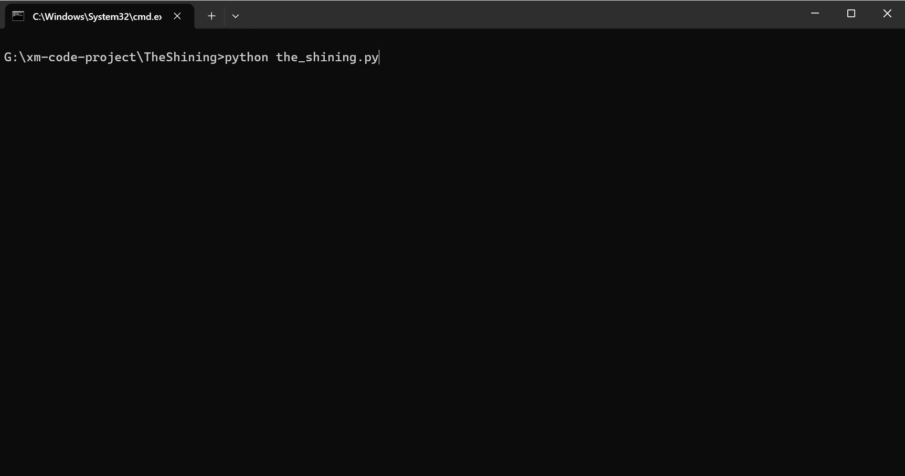

# 《闪灵》打字模拟器



这个 Python 脚本模拟了电影《闪灵》中 Jack Torrance 疯狂打字的经典场景，在终端中无限循环输出那句著名的台词：

> "All work and no play makes Jack a dull boy"

可以用来摸鱼，显得终端很忙的样子😋

## 功能特性

### 1. 逼真的打字机效果
- **逐字符输出**：模拟老式打字机逐字敲击的视觉效果。
- **随机延迟**：
  - 每个按键之间有 **0.03秒 ~ 0.15秒** 的随机打字节奏。
  - **思考停顿**：在单词空格处偶尔会出现较长的停顿，模拟打字者在思考或调整手指。
  - **回车换行**：每行结束换行前会有 0.3秒 ~ 0.8秒 的停顿。

### 2. 疯狂的错字模拟
为了最大化模拟《闪灵》，脚本引入了错字生成逻辑，每行有一定概率出现错字。错字类型包括：

- **相邻键误触**：模拟手指按到了 QWERTY 键盘上相邻的键。
- **漏打字符**：漏掉某个字母。
- **字符顺序颠倒**：相邻两个字母顺序搞反。

### 3. 震撼的退出效果
程序将无限运行，当你按下 `Ctrl+C` 强制中断时，屏幕上会出现一句熟悉的话😋

## 使用说明

### 系统要求
- Python 3.x
- 仅使用 Python 标准库，无需安装任何第三方包。

### 运行脚本
在终端中运行以下命令：

```bash
python the_shining.py
```

要停止脚本，请按 `Ctrl+C`。

## 自定义配置
你可以打开 `the_shining.py` 文件并调整以下参数：
- **错字概率**：修改 `apply_typos` 函数
- **打字速度**：调整 `type_writer` 函数
